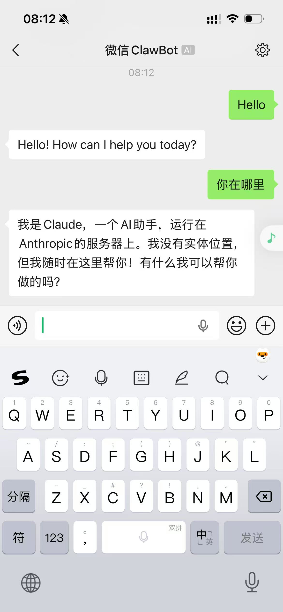
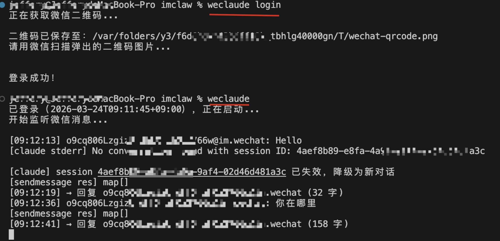

# weclaude

通过微信 ClawBot 与本地 Claude Code 对话的中间层服务。

发送消息给微信 ClawBot → weclaude 转发给本地 `claude` CLI → 将回复发回微信。




## 前置条件

- [Claude Code](https://docs.anthropic.com/en/docs/claude-code) 已安装并完成登录（`claude` 命令可用）
- 微信账号（用于扫码登录 ClawBot）
- 从源码编译时需要 Go 1.22+

## 安装

### 方式一：一键安装脚本（推荐）

```bash
/bin/bash -c "$(curl -fsSL https://raw.githubusercontent.com/imclaw/weclaude/main/install.sh)"
```

自动检测系统和架构，下载最新版本并安装到 `/usr/local/bin/weclaude`。

### 方式二：手动下载二进制

前往 [Releases](https://github.com/imclaw/weclaude/releases/latest) 页面，下载对应平台的文件：

| 平台 | 文件名 |
|------|--------|
| macOS (Apple Silicon) | `weclaude-darwin-arm64` |
| macOS (Intel) | `weclaude-darwin-amd64` |
| Linux (x86_64) | `weclaude-linux-amd64` |
| Linux (ARM64) | `weclaude-linux-arm64` |
| Windows (x86_64) | `weclaude-windows-amd64.exe` |

下载后赋予执行权限（macOS / Linux）：

```bash
chmod +x weclaude-darwin-arm64
sudo mv weclaude-darwin-arm64 /usr/local/bin/weclaude
```

### 方式二：从源码编译

需要 Go 1.22+。

```bash
git clone https://github.com/imclaw/weclaude
cd weclaude
go install .
```

编译后二进制文件为 `weclaude`，会被安装到 `$GOPATH/bin`（确保该路径在 `$PATH` 中）。

也可以直接编译到当前目录：

```bash
go build -o weclaude .
```

## 使用

### 启动服务

```bash
weclaude
```

直接运行即可。若尚未登录，会自动弹出二维码，扫码授权后立即开始监听微信消息。登录凭证保存在本地，下次启动无需重复登录。

### 后台运行（守护进程）

```bash
weclaude daemon   # 在后台启动服务
weclaude stop     # 停止后台服务
weclaude status   # 查看登录状态和守护进程信息
```

### 其他命令

```bash
weclaude login                  # 手动扫码登录
weclaude contacts               # 列出所有已知联系人 ID
weclaude send <text>            # 主动发送消息给默认用户（登录用户）
weclaude send <userID> <text>   # 主动发送消息给指定联系人
weclaude reset                  # 清除所有会话（开始全新对话）
weclaude logout                 # 退出登录
```

## 会话管理

- 每个微信联系人独立维护一个 Claude 会话上下文
- 发送 `/reset`、`重置`、`reset`、`/new` 或 `新对话` 可清除当前联系人的会话

## 环境变量

| 变量 | 说明 | 默认值 |
|------|------|--------|
| `CLAUDE_BIN` | `claude` 可执行文件路径 | `claude` |

## 数据存储

登录凭证和会话状态保存在系统配置目录下（`~/.config/weclaude/` 或系统对应路径），权限为 `0600`。
